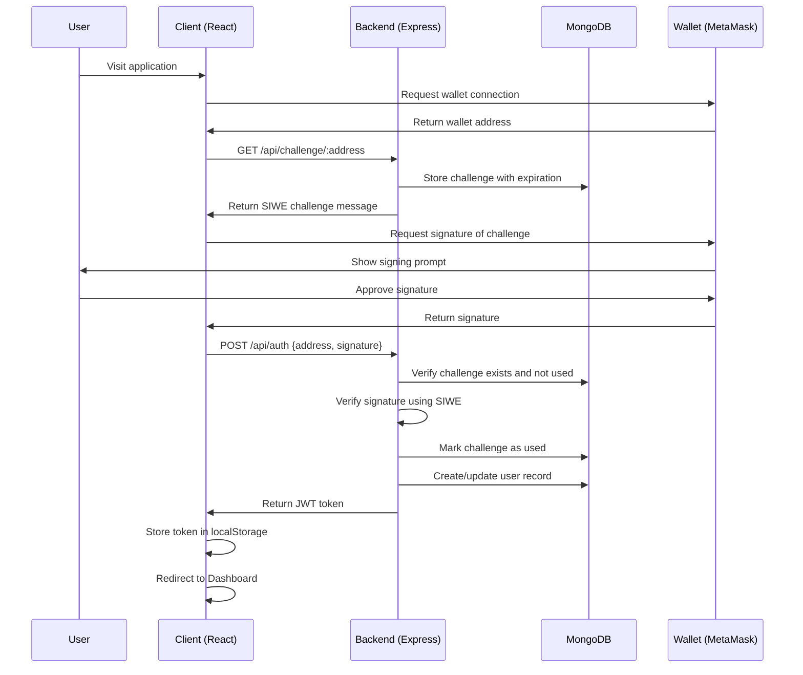
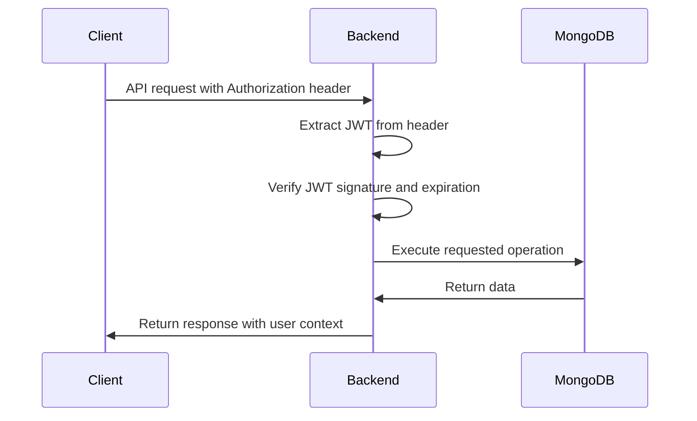
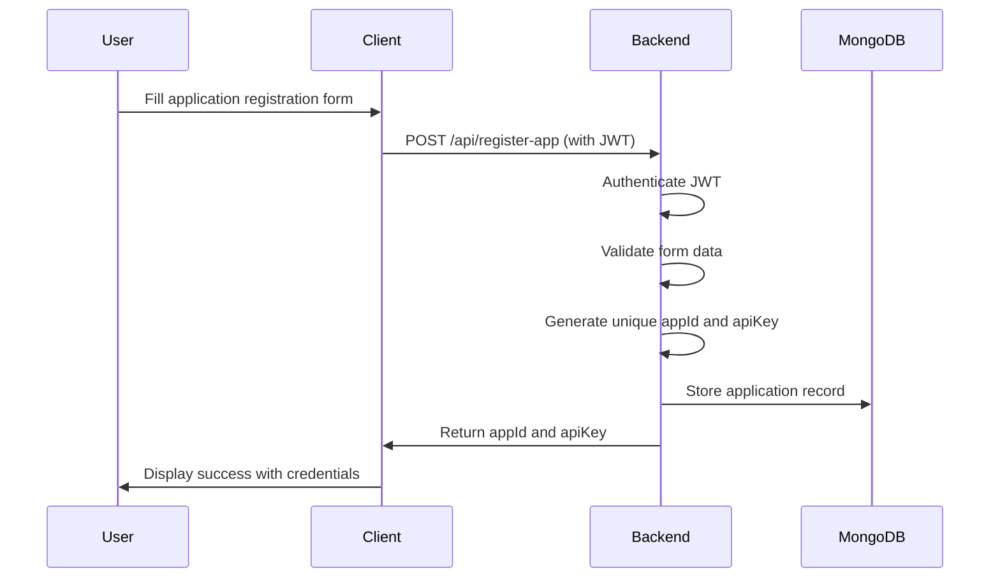

# DID (Decentralized Identity) System Architecture

## Overview

The DID project is a comprehensive decentralized identity authentication system built around SIWE (Sign-In with Ethereum) protocol. It consists of three main components that work together to provide wallet-based authentication without traditional passwords.

## System Components

### 1. Backend (Node.js/Express Server)
### 2. Client (React Frontend Application)  
### 3. Auth Package (Reusable NPM Package)

---

## 1. Backend Component

### Tech Stack
- **Runtime**: Node.js with ES6 modules
- **Framework**: Express.js 5.1.0
- **Database**: MongoDB Atlas (cloud-hosted)
- **Authentication**: SIWE (Sign-In with Ethereum) 3.0.0
- **Blockchain**: Ethers.js 6.15.0 for Ethereum interactions
- **Security**: JWT tokens, CORS, Rate limiting
- **Environment**: dotenv for configuration

### Key Dependencies
```json
{
  "cors": "^2.8.5",
  "dotenv": "^16.6.1", 
  "ethers": "^6.15.0",
  "express": "^5.1.0",
  "express-rate-limit": "^8.1.0",
  "jsonwebtoken": "^9.0.2",
  "mongoose": "^8.18.0",
  "morgan": "^1.10.0",
  "siwe": "^3.0.0"
}
```

### Database Schema

#### User Schema
```javascript
{
  address: String (unique, required),     // Ethereum wallet address
  logins: [{                             // Login history tracking
    timestamp: Date,
    ip: String (default: "unknown")
  }],
  ensName: String,                       // Resolved ENS name
  reloginPeriod: Number (default: 60),   // JWT expiration in minutes
  createdAt: Date (default: Date.now)
}
```

#### Challenge Schema
```javascript
{
  address: String (required),            // User's wallet address
  challenge: String (required),          // SIWE challenge message
  expiresAt: Date (required),           // Challenge expiration (15 min)
  used: Boolean (default: false)        // Prevents replay attacks
}
```

#### App Schema (Project Management)
```javascript
{
  appId: String (unique, required),      // Generated app identifier
  appName: String (required),           // Application name
  developerName: String (required),     // Developer information
  email: String (required),             // Contact email
  organizationName: String,             // Optional organization
  profession: String (required),        // Developer profession
  category: String,                     // App category
  description: String,                  // App description
  ownerAddress: String (required),      // Wallet address of owner
  apiKey: String (unique, required),    // Generated API key
  isActive: Boolean (default: true),    // App status
  createdAt: Date (default: Date.now),  // Creation timestamp
  lastUsed: Date,                       // Last usage tracking
  usage: {                              // Usage analytics
    totalRequests: Number (default: 0),
    monthlyRequests: Number (default: 0),
    lastReset: Date (default: Date.now)
  }
}
```

### API Endpoints

#### Authentication Flow
1. **GET /api/challenge/:address** - Generate SIWE challenge
2. **POST /api/auth** - Verify signature and issue JWT token

#### User Management (Authenticated)
3. **GET /api/userinfo** - Get user profile and statistics
4. **POST /api/settings/relogin-period** - Configure JWT expiration

#### Application Management (Authenticated)
5. **POST /api/register-app** - Register new application
6. **GET /api/my-apps** - List user's applications
7. **GET /api/app/:appId** - Get specific app details
8. **PUT /api/apps/:appId** - Update application details
9. **DELETE /api/apps/:appId** - Delete application

#### Utilities
10. **GET /api/stats/users** - Public user statistics
11. **POST /api/resolve-ens** - ENS name resolution via Infura
12. **POST /api/register-ip** - IP tracking endpoint

### Security Features
- **JWT Authentication**: Configurable token expiration per user
- **Rate Limiting**: 100 requests per 15 minutes per IP/address
- **CORS Protection**: Configured for localhost:5173
- **Challenge Expiration**: 15-minute window for SIWE challenges
- **Replay Attack Prevention**: One-time use challenges
- **IP Tracking**: Login history with IP addresses
- **ENS Integration**: Optional ENS name resolution

---

## 2. Client Component (React Frontend)

### Tech Stack
- **Framework**: React 19.1.1 with Vite 7.1.2
- **Styling**: Tailwind CSS 4.1.13
- **Routing**: React Router DOM 7.8.2
- **Blockchain**: Ethers.js 6.15.0 for wallet interactions
- **State Management**: React Context API
- **Authentication**: JWT tokens with jwt-decode
- **UI Components**: Lucide React icons, React Icons

### Key Dependencies
```json
{
  "react": "^19.1.1",
  "react-dom": "^19.1.1",
  "react-router-dom": "^7.8.2",
  "ethers": "^6.15.0",
  "jwt-decode": "^4.0.0",
  "tailwindcss": "^4.1.13",
  "lucide-react": "^0.542.0",
  "react-icons": "^5.5.0"
}
```

### Application Structure

#### Main Components
1. **App.jsx** - Root component with routing configuration
2. **NewAuth.jsx** - Wallet connection and SIWE authentication
3. **Dashboard.jsx** - Main user interface after authentication
4. **AppRegistration.jsx** - New application registration form
5. **AppSetup.jsx** - Application management and settings
6. **SIWEDocs.jsx** - Documentation and integration guides

#### Authentication Flow (NewAuth.jsx)
```javascript
// 1. Wallet Connection
const connectWallet = async () => {
  const provider = new ethers.BrowserProvider(window.ethereum);
  await provider.send("eth_requestAccounts", []);
  const signer = await provider.getSigner();
  const address = await signer.getAddress();
  // ENS resolution attempt
}

// 2. Challenge Request & Signing
const handleSubmit = async (e) => {
  // Get challenge from backend
  const res = await fetch(`/api/challenge/${account}`);
  const { challenge } = await res.json();
  
  // Sign challenge with wallet
  const signature = await signer.signMessage(challenge);
  
  // Submit for verification
  const authRes = await fetch("/api/auth", {
    method: "POST",
    body: JSON.stringify({ address: account, signature })
  });
}
```

### State Management
- **Local Storage**: JWT token persistence
- **React Context**: Notification system
- **Component State**: Authentication status, user data
- **URL Parameters**: Deep linking support (e.g., ?tab=settings)

### Security Features
- **Token Validation**: Automatic JWT expiration checking
- **Account Change Detection**: MetaMask account switching handling
- **Session Management**: Automatic logout on token expiration
- **Input Validation**: Address format validation
- **Error Handling**: Comprehensive error states and user feedback

---

## 3. Auth Package (Reusable NPM Package)

### Tech Stack
- **Package Name**: @gitalien/auth_package
- **Version**: 1.2.0
- **Runtime**: Node.js (CommonJS modules)
- **Testing**: Jest with MongoDB Memory Server
- **Coverage**: Comprehensive test coverage reporting

### Key Dependencies
```json
{
  "cors": "^2.8.5",
  "ethers": "^6.15.0", 
  "express": "^5.1.0",
  "express-rate-limit": "^8.1.0",
  "jsonwebtoken": "^9.0.2",
  "mongoose": "^8.18.2",
  "siwe": "^3.0.0"
}
```

### Package Structure
```
auth_package/
├── index.js              # Main entry point
├── lib/
│   ├── auth.js           # Core authentication logic
│   ├── schemas.js        # MongoDB schemas
│   └── middleware.js     # JWT middleware
├── example.js            # Usage examples
├── frontend-example.jsx  # React integration example
└── README.md            # Documentation
```

### Core Functions

#### Main Initialization
```javascript
function initializeSwecAuth(config = {}) {
  // Validates required config (mongoUri, jwtSecret)
  // Sets up Express router with auth routes
  // Returns configured router for mounting
}
```

#### Authentication Middleware
```javascript
function authenticateJWT(jwtSecret) {
  return (req, res, next) => {
    // Extracts JWT from Authorization header
    // Verifies token signature and expiration
    // Attaches decoded user to req.user
  }
}
```

### Configuration Options
```javascript
const config = {
  mongoUri: "mongodb://...",           // Required: Database connection
  jwtSecret: "secret-key",             // Required: JWT signing key
  corsOrigins: ["http://localhost:3000"], // Optional: CORS origins
  domain: "yourdomain.com",            // Optional: SIWE domain
  uri: "https://yourdomain.com",       // Optional: SIWE URI
  chainId: 1,                          // Optional: Blockchain chain ID
  infuraKey: "infura-key",             // Optional: ENS resolution
  rateLimit: {                         // Optional: Rate limiting config
    windowMs: 15 * 60 * 1000,
    max: 100
  }
}
```

---

## System Control Flow

### 1. Initial Authentication Flow



### 2. Authenticated Request Flow



### 3. Application Registration Flow



---

## Integration Architecture

### Backend ↔ Auth Package Integration
The backend server (`server.js`) implements the same authentication logic that's packaged in the auth package. The auth package serves as a reusable library that other developers can integrate into their own Express applications.

**Key Integration Points:**
- Shared MongoDB schemas (User, Challenge, App)
- Identical API endpoint structure
- Same JWT authentication middleware
- Compatible SIWE implementation

### Client ↔ Backend Integration
The React client communicates with the backend through RESTful API calls:

**Authentication Integration:**
- Wallet connection via ethers.js and MetaMask
- SIWE challenge/response flow
- JWT token management and automatic renewal
- Session persistence across browser refreshes

**Application Management Integration:**
- CRUD operations for registered applications
- Real-time form validation and error handling
- File upload and project management features

### Cross-Component Data Flow

1. **User Authentication State**: Managed in React context and localStorage
2. **API Communication**: Axios/fetch with automatic JWT header injection  
3. **Error Handling**: Centralized error boundaries and notification system
4. **Real-time Updates**: Polling for notification updates and user statistics

---

## Security Considerations

### Authentication Security
- **No Password Storage**: Wallet-based authentication eliminates password vulnerabilities
- **Challenge Expiration**: 15-minute window prevents replay attacks
- **One-time Challenges**: Each challenge can only be used once
- **JWT Expiration**: Configurable token lifetime (default 60 minutes)

### API Security
- **Rate Limiting**: Prevents brute force and DoS attacks
- **CORS Configuration**: Restricts cross-origin requests
- **Input Validation**: Address format and signature validation
- **Authorization Checks**: User ownership verification for app management

### Frontend Security
- **Token Validation**: Automatic JWT expiration checking
- **Secure Storage**: localStorage with automatic cleanup
- **Account Monitoring**: Detects MetaMask account changes
- **Error Boundaries**: Prevents application crashes from exposing sensitive data

---

## Deployment Architecture

### Development Environment
- **Backend**: localhost:5000 (Express server)
- **Frontend**: localhost:5173 (Vite dev server)
- **Database**: MongoDB Atlas (cloud)
- **Blockchain**: Ethereum Mainnet (for ENS) + MetaMask

### Production Considerations
- **Environment Variables**: Secure configuration management
- **HTTPS Enforcement**: SSL/TLS for all communications
- **Database Security**: MongoDB Atlas with authentication
- **CDN Integration**: Static asset optimization
- **Load Balancing**: Horizontal scaling for high availability

---

## Performance Optimizations

### Backend Optimizations
- **Database Indexing**: Automatic challenge cleanup with TTL indexes
- **Connection Pooling**: MongoDB connection optimization
- **Caching**: JWT verification caching
- **Rate Limiting**: Prevents resource exhaustion

### Frontend Optimizations
- **Code Splitting**: React Router lazy loading
- **Bundle Optimization**: Vite build optimization
- **State Management**: Efficient React context usage
- **Image Optimization**: Lazy loading and compression

---

## Monitoring and Analytics

### User Analytics
- **Login Tracking**: Timestamp and IP address logging
- **Usage Statistics**: Total users and active users (30 days)
- **Session Management**: Token expiration tracking
- **Error Monitoring**: Authentication failure logging

### Application Analytics
- **Registration Metrics**: New app creation tracking
- **Usage Patterns**: API key usage monitoring
- **Performance Metrics**: Response time tracking
- **Security Events**: Failed authentication attempts

---

## Future Enhancements

### Planned Features
1. **Multi-chain Support**: Polygon, Arbitrum, Optimism
2. **Advanced ENS Integration**: Avatar and metadata resolution
3. **Social Recovery**: Multi-signature wallet support
4. **API Rate Limiting**: Per-application rate limits
5. **Analytics Dashboard**: Real-time usage metrics
6. **Mobile App**: React Native implementation

### Scalability Improvements
1. **Microservices Architecture**: Service decomposition
2. **Redis Caching**: Session and challenge caching
3. **Message Queues**: Asynchronous processing
4. **CDN Integration**: Global content delivery
5. **Database Sharding**: Horizontal database scaling

---

## Conclusion

The DID system represents a comprehensive implementation of decentralized identity authentication using modern web technologies. The three-component architecture (Backend, Client, Auth Package) provides a robust, scalable, and secure foundation for wallet-based authentication systems.

**Key Strengths:**
- **Security**: Eliminates password vulnerabilities through wallet-based auth
- **Modularity**: Reusable auth package for easy integration
- **User Experience**: Seamless wallet connection and management
- **Scalability**: Cloud-native architecture with MongoDB Atlas
- **Developer Experience**: Comprehensive documentation and examples

**Technical Excellence:**
- **Modern Stack**: Latest versions of React, Node.js, and supporting libraries
- **Best Practices**: Proper error handling, security measures, and code organization
- **Testing**: Comprehensive test coverage with Jest and MongoDB Memory Server
- **Documentation**: Detailed setup guides and API documentation

This architecture serves as a solid foundation for building decentralized applications that require secure, user-friendly authentication without traditional password systems.
